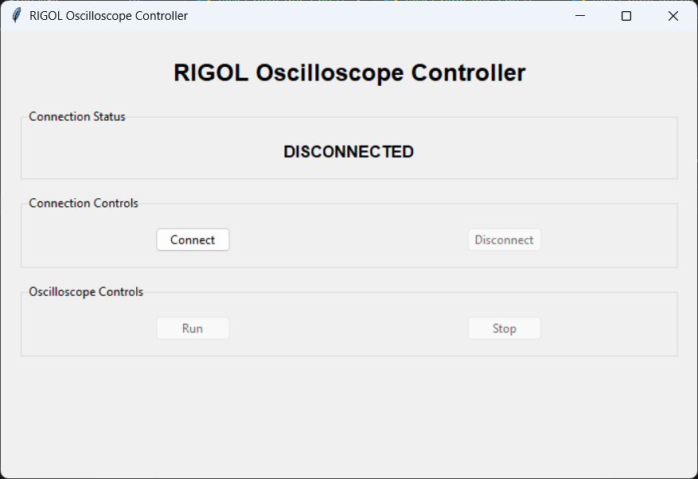
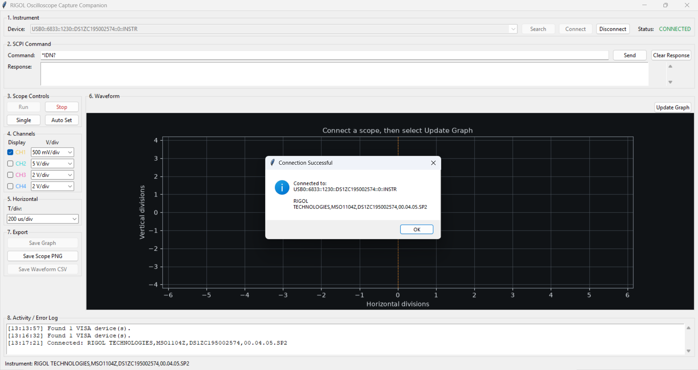
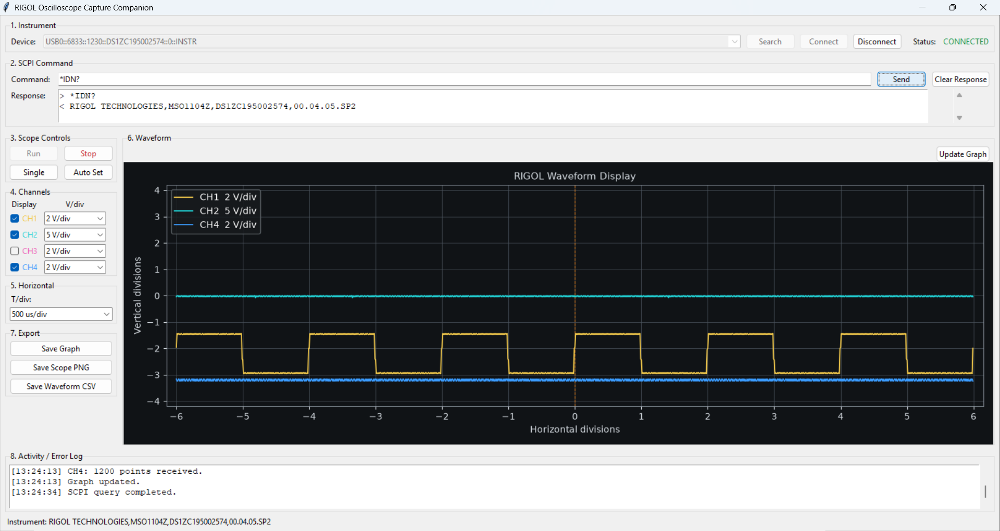
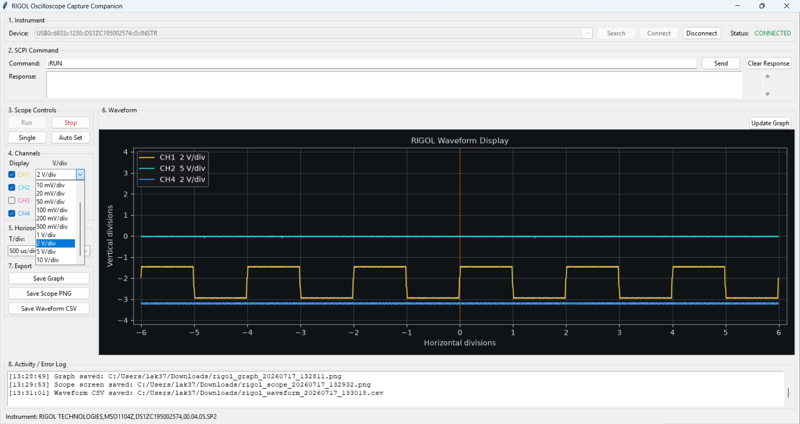

# Python/Tkinter Simple RIGOL Controller

A Python/Tkinter desktop application for discovering, connecting to, and controlling a RIGOL MSO/DS1000Z oscilloscope through USB VISA. The application provides a compact interface for common laboratory operations, waveform viewing, SCPI communication, and data export.

## Objectives

- Build a practical GUI for remote oscilloscope operation.
- Communicate with a RIGOL oscilloscope by using PyVISA and SCPI commands.
- Display waveform data from multiple channels in an embedded Matplotlib graph.
- Save measurement results for later analysis and reporting.
- Apply object-oriented programming to separate instrument communication from the GUI.

## Main Features

The features are organized into the same eight sections shown in the user interface.

### 1. Instrument

Manages device discovery and the connection between the application and the oscilloscope.

- Search for connected USB VISA devices
- Select an oscilloscope from the device list
- Connect to or disconnect from the selected instrument
- Display the connection status and instrument information

### 2. SCPI Command

Provides direct communication with the oscilloscope through standard SCPI commands.

- Send manual SCPI commands and queries
- Display responses returned by the oscilloscope
- Keep SCPI responses separate from the activity log

### 3. Scope Controls

Provides the main controls for operating the oscilloscope acquisition state.

- Start continuous acquisition with **Run**
- Stop acquisition with **Stop**
- Capture one acquisition with **Single**
- Automatically configure the waveform with **Auto Set**

### 4. Channels

Controls the display and vertical scale of each oscilloscope input channel.

- Enable or disable CH1-CH4
- Adjust the V/div value of each channel
- Display each channel using its oscilloscope color

### 5. Horizontal

Controls the horizontal time scale of the oscilloscope and waveform graph.

- Select the horizontal T/div setting
- Apply the selected time scale to the oscilloscope

### 6. Waveform

Retrieves waveform data from the oscilloscope and displays it inside the application.

- Retrieve waveform samples from enabled channels
- Display waveforms using an embedded Matplotlib graph
- Refresh the displayed data with **Update Graph**

### 7. Export

Saves oscilloscope results in formats suitable for reports and further analysis.

- Save the displayed graph as PNG
- Save the original oscilloscope screen as PNG
- Export waveform samples as CSV

### 8. Activity / Error Log

Displays program activities and errors separately from oscilloscope responses.

- Record connection and program activities
- Display completed export operations
- Report communication and waveform errors

## Requirements

### Software

- **Python:** Version 3.10 or later
- **Tkinter:** Creates the graphical user interface and is normally included with Python on Windows
- **NumPy:** Processes waveform sample data
- **Matplotlib:** Displays and saves waveform graphs
- **PyVISA:** Provides VISA instrument communication
- **PyVISA-Py:** Provides the Python VISA backend
- **PyUSB:** Supports communication with USB instruments

### Hardware

- RIGOL MSO/DS1000Z-series oscilloscope
- USB cable
- VISA-compatible USB driver

## Installation

1. Download or clone this repository.
2. Open a terminal in the project folder.
3. Create and activate a virtual environment (recommended):

```powershell
python -m venv .venv
.venv\Scripts\Activate.ps1
```

4. Install the required packages:

```powershell
python -m pip install numpy matplotlib pyvisa pyvisa-py pyusb
```

5. Connect the oscilloscope to the computer through USB and ensure that Windows recognizes it as a VISA-compatible device.

## Running the Program

Run the application from the project folder:

```powershell
python task2_rigol_gui.py
```

## Basic Usage

1. Select **Search** to detect connected USB VISA instruments.
2. Select the oscilloscope address in the **Device** list.
3. Select **Connect**. A successful connection displays the instrument identity.
4. Use the scope controls or send a SCPI query such as `*IDN?`.
5. Select the required channels and V/div values.
6. Select a T/div value and then select **Update Graph** to retrieve waveform data.
7. Use the export buttons to save the graph, oscilloscope screen, or waveform CSV.
8. Select **Disconnect** before closing the application or unplugging the instrument.

## GUI Design

The interface is divided into clear functional areas:

- **Instrument:** searches for VISA devices and manages connection status.
- **SCPI Command:** sends manual commands or queries and displays oscilloscope responses.
- **Scope Controls:** provides Run, Stop, Single, and Auto Set operations.
- **Channels:** enables CH1-CH4 and controls the vertical scale of each channel.
- **Horizontal:** controls the oscilloscope time scale.
- **Waveform:** displays acquired channel data with oscilloscope-style colors and divisions.
- **Export:** saves the graph, the original scope screen, or waveform data.
- **Activity / Error Log:** records program events without mixing them with SCPI responses.

Controls that require an active instrument are disabled while disconnected. Run and Stop button states are also synchronized with the oscilloscope operating state.

## OOP Class Structure

### `ScopeController`

Handles instrument-related work independently of Tkinter. Its responsibilities include VISA discovery and connection management, SCPI read/write operations, channel and timebase settings, binary waveform transfer, and oscilloscope screenshot capture.

### `RigolApp`

Builds the Tkinter interface and handles user interaction. It updates widget states, displays responses and logs, draws waveforms with Matplotlib, schedules refreshes, and manages file export dialogs.

This separation keeps hardware communication independent from presentation logic and makes the code easier to understand, test, and maintain.

## Screenshots

### Preliminary GUI

The first version contained the basic connection state and Run/Stop controls.



### Successful Instrument Connection

The application detected and connected to a RIGOL MSO1104Z through a USB VISA resource.



### SCPI Communication and Waveform Display

The `*IDN?` query returned the oscilloscope identification string, while waveform data from the enabled channels was displayed in the GUI.



### Channel Settings and Export Functions

The completed interface supports channel scale selection and confirms saved graph, scope-screen, and CSV files in the activity log.



## Notes

- The GUI is a companion to the physical oscilloscope rather than a complete replacement for its front panel.
- Waveforms are retrieved when **Update Graph** is selected; the display is not intended to replace the oscilloscope's high-speed real-time screen.
- The program uses the PyVISA-Py backend (`@py`) for USB communication.

## Author

Chotika — Assignment 3, Task 2
